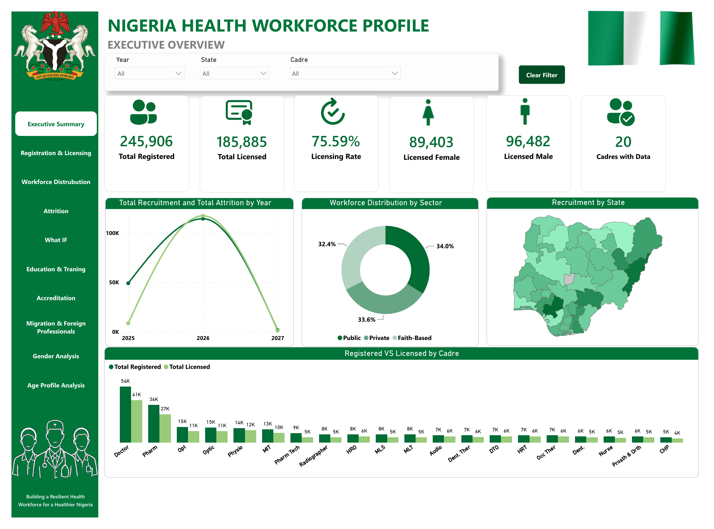
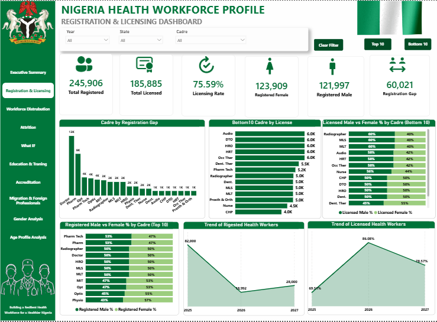
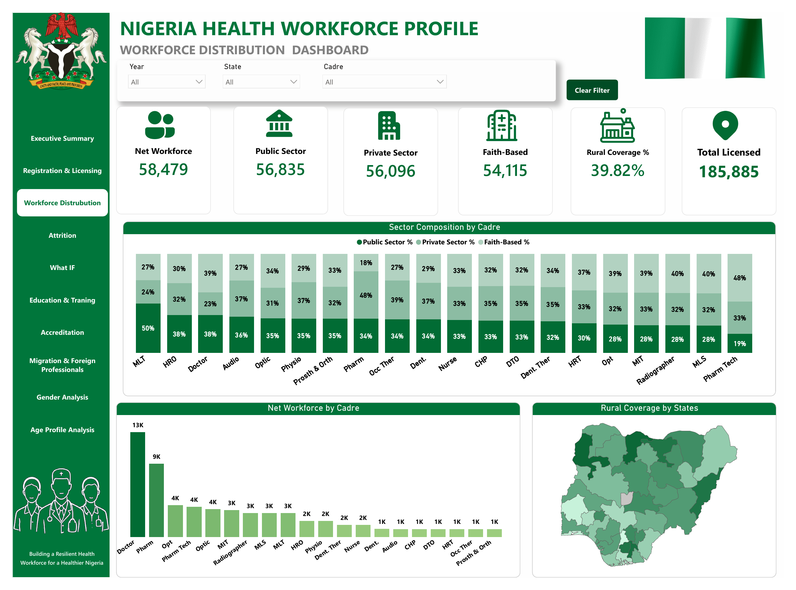
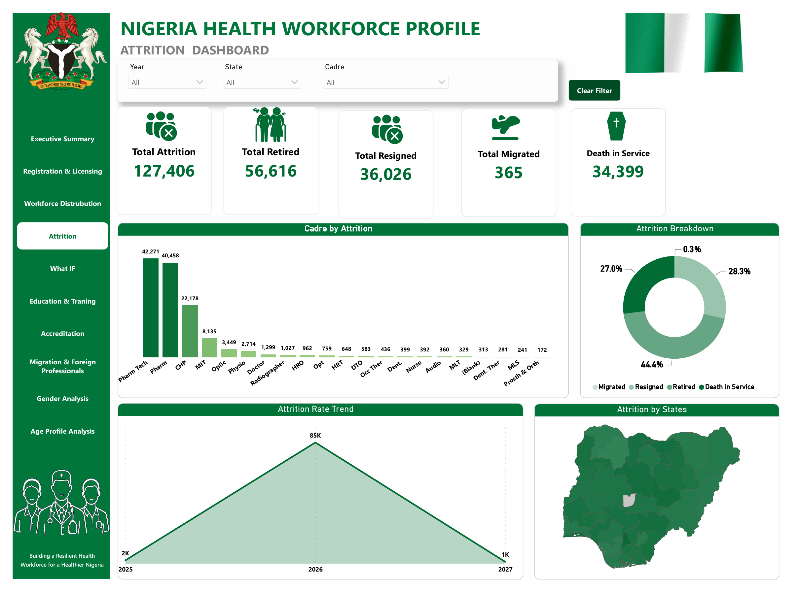
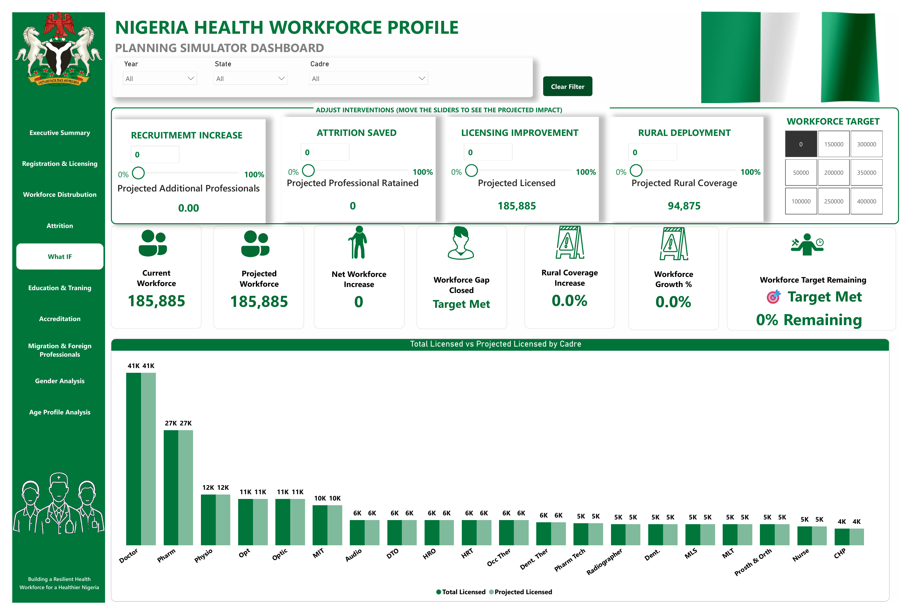
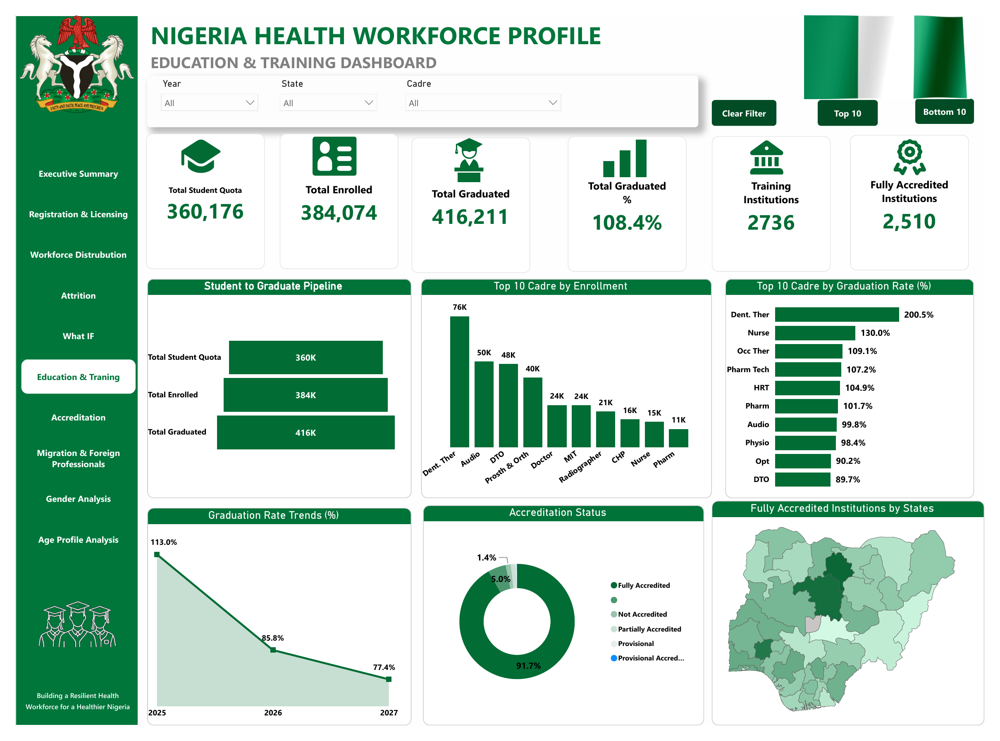
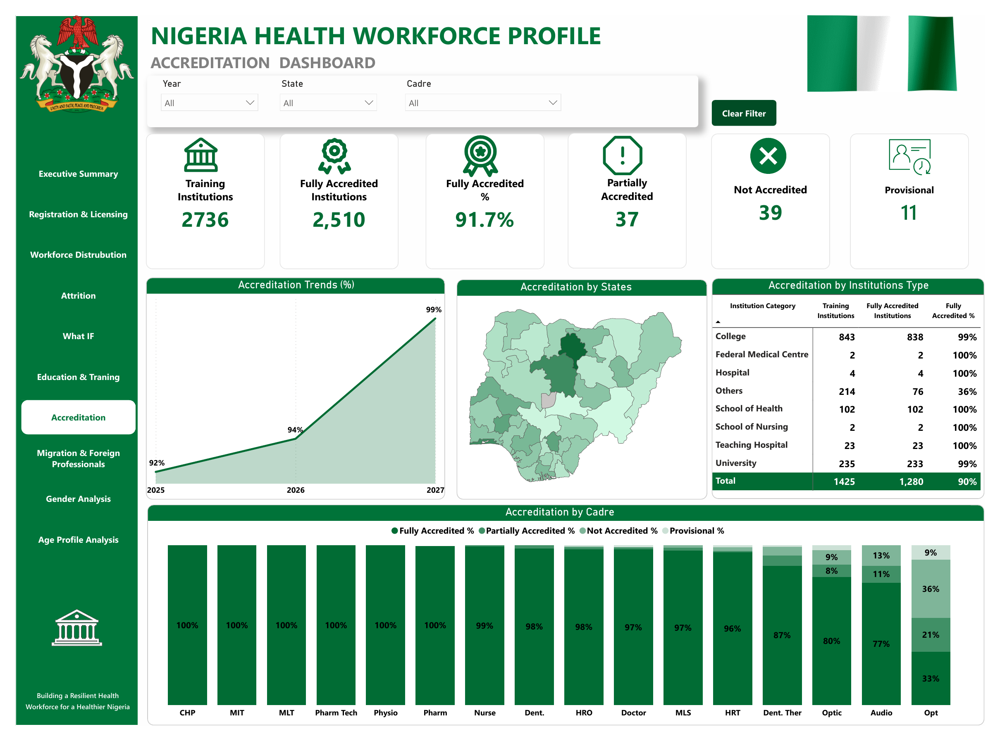
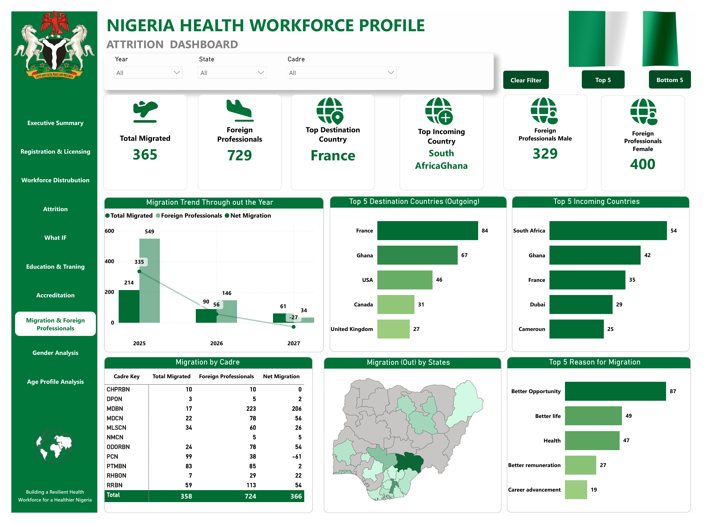
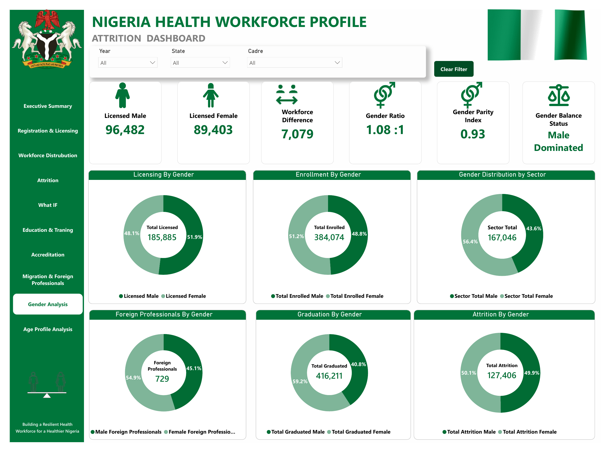
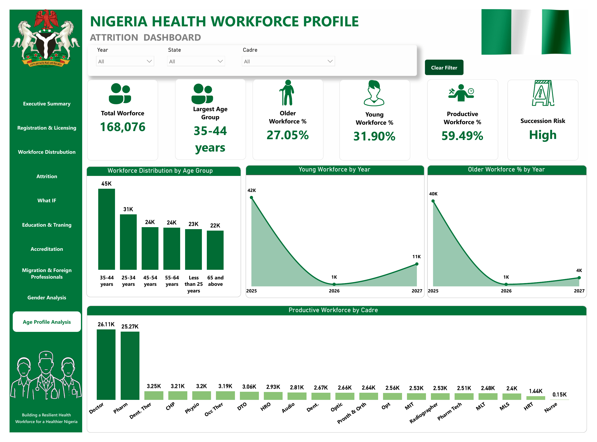

# Nigeria Health Workforce Profile — 2025 (Proposed Dashboard)
 
**Building a Resilient Health Workforce for a Healthier Nigeria**
 
Prepared by: **StarTechOne Nigeria**
Tools: **SPSS** (statistical analysis) + **Power BI Desktop** (dashboard & visualization)
 
> ⚠️ **Note:** This is a **prototype dashboard** developed by Startechone Nigeria to demonstrate how national health workforce data could be analyzed and visualized. It uses illustrative Federal Ministry of Health & Social Welfare branding as a design concept and is not an official Ministry publication or live production system.
 
---
 
## 📌 Project Overview
 
Nigeria's health system depends on having enough qualified, well-distributed health workers to meet population needs. This project proposes an analytics solution for the national health workforce — covering registration, licensing, distribution, attrition, education pipeline, accreditation, migration, and demographic composition — to show how policymakers could gain a clear, data-driven view of workforce capacity and risk.
 
As proposed, workforce data would be cleaned, validated, and statistically analyzed in **SPSS** before being modeled and visualized in an interactive **Power BI** dashboard, giving decision-makers both a rigorous statistical foundation and an accessible, filterable reporting tool for ongoing workforce planning.
 
---
 
## 🎯 Objectives
 
- Determine the total size, registration status, and licensing rate of Nigeria's health workforce
- Analyze workforce distribution across sectors (Public, Private, Faith-Based) and states, including rural coverage
- Quantify attrition — retirement, resignation, migration, and death in service — and identify at-risk cadres
- Model future workforce scenarios through an interactive planning simulator (recruitment, attrition savings, licensing improvement, rural deployment)
- Assess the education and training pipeline, from student quotas through enrollment to graduation
- Evaluate institutional accreditation status across training institution types and states
- Track migration of health professionals, including destination/origin countries and stated reasons for leaving
- Examine gender balance and age profile across the workforce to flag succession risk
---
 
## 🧮 Proposed Methodology: SPSS + Power BI
 
This project demonstrates a two-stage analytical workflow:
 
**1. SPSS — Data Preparation & Statistical Analysis**
- Data cleaning, validation, and consistency checks across registration, licensing, and attrition records
- Descriptive statistics (frequencies, percentages, cross-tabulations) underlying the KPIs shown on each dashboard page
- Trend and comparative analysis (e.g., year-over-year attrition and licensing trends, gender distribution significance) used to validate patterns before they were built into the dashboard
- Output tables and computed fields exported for use as the modeled dataset in Power BI
**2. Power BI — Dashboard & Reporting Layer**
- Data modeling and DAX measures built on the SPSS-validated dataset
- Interactive, filterable dashboard (Year, State, Cadre) across 10 report pages
- What-if planning simulator using parameter tables to project workforce outcomes under different intervention scenarios
> 📁 If you're including your `.sav` (SPSS data file) and syntax/output files in this repo, list them in the **Repository Contents** section below so others can trace the analysis from raw data through to the final dashboard.
 
---
 
## 🗂 Dashboard Structure
 
| Page | Description |
|------|-------------|
| **Executive Summary** | Headline KPIs — total registered, licensed, licensing rate, gender split — plus recruitment/attrition trends, sector distribution, and recruitment by state |
| **Registration & Licensing** | Registration gaps by cadre, top/bottom 10 cadres by license, male vs. female licensing by cadre, and registration/licensing trends |
| **Workforce Distribution** | Net workforce by cadre, sector composition (Public/Private/Faith-Based) by cadre, and rural coverage by state |
| **Attrition** | Total attrition breakdown (retired, resigned, migrated, death in service), attrition by cadre, and attrition trend/state map |
| **What IF (Planning Simulator)** | Interactive sliders for recruitment increase, attrition saved, licensing improvement, and rural deployment, with projected workforce impact |
| **Education & Training** | Student-to-graduate pipeline, top cadres by enrollment and graduation rate, graduation trends, and accreditation status |
| **Accreditation** | Institution-level accreditation status by type and state, accreditation trends, and accreditation by cadre |
| **Migration & Foreign Professionals** | Migration trends, top destination/incoming countries, migration by cadre, and top reasons for migration |
| **Gender Analysis** | Gender breakdown across licensing, enrollment, sector distribution, foreign professionals, graduation, and attrition |
| **Age Profile Analysis** | Workforce distribution by age group, young/older workforce trends, productive workforce by cadre, and succession risk |
 
All pages support global **Year**, **State**, and **Cadre** filters.
 
---
 
## 📊 Key Metrics (KPIs)
 
| Metric | Value |
|--------|-------|
| Total Registered | 245,906 |
| Total Licensed | 185,885 |
| Licensing Rate | 75.59% |
| Cadres with Data | 20 |
| Total Attrition | 127,406 |
| Total Retired | 56,616 |
| Total Resigned | 36,026 |
| Total Migrated | 365 |
| Death in Service | 34,399 |
| Foreign Professionals | 729 |
| Total Student Quota | 360,176 |
| Total Graduated | 416,211 |
| Fully Accredited Institutions | 2,510 (91.7%) |
| Succession Risk | High |
 
*Figures shown are based on the sample/demo dataset used to build this proposed dashboard.*
 
---
 
## 🔍 Key Findings
 
**Registration & Licensing**
- Overall licensing rate stands at **75.59%**, leaving a registration gap of **60,021** professionals
- **Doctors** and **Pharmacists** are the two largest cadres by both registration and licensing, far outpacing all others
- Licensing trend shows a sharp rise from 69.51% (2025) to 86.08% (2026) before a slight pullback to 78.57% (2027)
**Workforce Distribution**
- Workforce is fairly evenly split across sectors: **Public (34.0%)**, **Private (33.6%)**, **Faith-Based (32.4%)**
- Rural coverage sits at just **39.82%**, indicating a significant urban concentration of health workers
**Attrition**
- Attrition breakdown: **Retired (44.4%)**, **Resigned (28.3%)**, **Death in Service (27.0%)**, **Migrated (0.3%)**
- **Pharmacy Technicians** and **Pharmacists** account for the largest share of attrition by cadre (42,271 and 40,458 respectively)
- Attrition rate trend peaks sharply in 2026 (85K) before falling in 2027
**Education & Training**
- Total graduated (416,211) exceeds total enrolled (384,074), producing a graduation rate above 100% — likely reflecting multi-year cohort effects rather than a single intake-to-output ratio
- **Dental Therapy** and **Nursing** show unusually high graduation rates (200.5% and 130.0%), warranting a data-quality review
- **91.7%** of training institutions are fully accredited; **Optometry** and **Audiology** programs show the lowest accreditation rates among cadres
**Migration**
- **France** is the top destination country for outgoing Nigerian health professionals (84), followed by **Ghana** (67) and the **USA** (46)
- **South Africa** and **Ghana** are the leading source countries for incoming foreign professionals
- **"Better Opportunity"** is the most cited reason for migration (87 responses), ahead of "Better life" (49) and "Health" (47)
**Gender**
- The workforce is slightly **male-dominated**, with a gender ratio of **1.08:1** and a Gender Parity Index of **0.93**
- Enrollment (51.2% female) and graduation (59.2% female) skew female, while licensing (51.9% male) and the sector workforce (56.4% male) skew male — suggesting a potential drop-off between training and formal licensing that merits further investigation
**Age Profile**
- The **35–44 age group** is the largest segment of the workforce (45K)
- **27.05%** of the workforce is in the older bracket, against just **31.90%** young workforce — with succession risk flagged as **High**
---
 
## 💡 Recommendations
 
1. **Close the registration-to-licensing gap** (60,021 professionals) through streamlined licensing processes, particularly for high-volume cadres like Doctors and Pharmacists
2. **Prioritize rural deployment incentives** — rural coverage at under 40% suggests urban-rural imbalance in service access
3. **Investigate anomalous graduation rates** (e.g., Dental Therapy at 200.5%) to confirm data integrity before using them for planning
4. **Address succession risk** flagged in the Age Profile analysis by accelerating recruitment and retention of younger cadres
5. **Target retention interventions at high-attrition cadres** (Pharmacy Technicians, Pharmacists, CHPs) using the What-If simulator to model cost-effective interventions
6. **Study the licensing gender gap** between training/graduation (female-skewed) and final licensing (male-skewed) to identify and remove barriers
7. **Strengthen migration retention strategies** by addressing the top cited driver — "Better Opportunity" — through career development and remuneration reform
---
 
## 🛠 Tools & Skills Used
 
- **SPSS** — data cleaning, descriptive statistics, cross-tabulation, and trend validation
- **Power BI Desktop** — data modeling, DAX measures, interactive report design
- **DAX** — KPI, rate, and gap calculations across registration, licensing, and attrition
- **What-If Parameters** — interactive workforce planning simulator
- **Data Visualization** — KPI cards, donut charts, bar charts, line/area charts, choropleth maps, matrix tables
---
 
## 📁 Repository Contents
 
```
├── Nigeria_Health_Workforce_Dashboard.pbix   # Power BI source file
├── Nigeria_Health_Workforce_Dashboard.pdf    # Exported PDF walkthrough of the dashboard
├── Nigeria_Health_Workforce_Data.sav         # SPSS data file (add if sharing)
├── Nigeria_Health_Workforce_Syntax.sps       # SPSS syntax/output file (add if sharing)
├── 01-executive-summary.png
├── 02-registration-licensing.png
├── 03-workforce-distribution.png
├── 04-attrition.png
├── 05-what-if-planning-simulator.png
├── 06-education-training.png
├── 07-accreditation.png
├── 08-migration-foreign-professionals.png
├── 09-gender-analysis.png
├── 10-age-profile-analysis.png
└── README.md                                 # Project documentation (this file)
```
 
---
 
## 📷 Dashboard Preview
 
### Executive Summary

 
### Registration & Licensing

 
### Workforce Distribution

 
### Attrition

 
### What IF — Planning Simulator

 
### Education & Training

 
### Accreditation

 
### Migration & Foreign Professionals

 
### Gender Analysis

 
### Age Profile Analysis

 
